<p align="center">
  
</p>

<p align="center">
  <strong>A GPU-resident OpenFOAM 10 solver for compressible gas–particle flow</strong><br>
  Riemann gas dynamics · Gas-kinetic particles · CP-CST data orchestration
</p>

# GPU–Riemann–GKP

Current release: **2.8.0** · [Changelog](CHANGELOG.md)

GPU–Riemann–GKP advances a compressible Eulerian gas phase with configurable Riemann fluxes and a Lagrangian particle phase with the gas-kinetic particle method (GKP). The solver keeps mesh topology, conservative gas fields, particle structure-of-arrays state, random state, coupling ledgers, and restart state on the GPU throughout each time-step sequence.

The OpenFOAM frontend supplies familiar case dictionaries, patch fields, run control, field output, and restart management. The CUDA backend executes gas fluxes, viscous transport, gas–particle coupling, stochastic particle collisions, unstructured particle tracking, particle moments, and CP-CST maintenance.

<p align="center">
  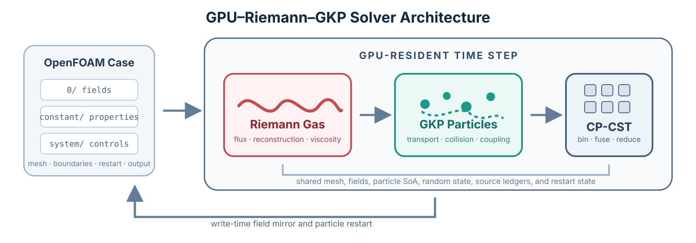
</p>

## Features

### 1. Riemann gas phase

The gas phase advances the compressible Navier–Stokes equations with interphase source terms,

```math
\frac{\partial \mathbf{Q}}{\partial t}
+\nabla\cdot\mathbf{F}^{\mathrm{inv}}
=\nabla\cdot\mathbf{F}^{\mathrm{vis}}+\mathbf{S}_{gp},
\qquad
\mathbf{Q}=
\begin{bmatrix}
\rho & \rho\mathbf{U} & \rho E
\end{bmatrix}^{\mathsf T}.
```

For a calorically perfect gas,

```math
E=e+\frac12\mathbf{U}\cdot\mathbf{U},
\qquad
p=(\gamma-1)\rho e,
\qquad
T=\frac{p}{\rho R},
\qquad
a=\sqrt{\frac{\gamma p}{\rho}}.
```

The source vector $\mathbf{S}_{gp}$ contains gas-volume displacement, two-way particle momentum and sensible-heat exchange, and body force. These source operators use the same conservative gas state as the face-transport operator.

#### Face-normal Euler flux

For a face with unit normal $\mathbf{n}$ and normal velocity $u_n=\mathbf{U}\cdot\mathbf{n}$, the inviscid physical flux per unit area is

```math
\mathbf{F}^{\mathrm{inv}}_n(\mathbf{Q})=
\begin{bmatrix}
\rho u_n\\
\rho\mathbf{U}u_n+p\mathbf{n}\\
(\rho E+p)u_n
\end{bmatrix}.
```

Cell-centred primitive variables are reconstructed to each face centre $\mathbf{x}_f$:

```math
\mathbf{V}^{-}_f
=\mathbf{V}_i+\boldsymbol{\phi}_i\odot
\left[\nabla\mathbf{V}_i\cdot(\mathbf{x}_f-\mathbf{x}_i)\right],
\qquad
\mathbf{V}^{+}_f
=\mathbf{V}_j+\boldsymbol{\phi}_j\odot
\left[\nabla\mathbf{V}_j\cdot(\mathbf{x}_f-\mathbf{x}_j)\right],
```

where $\mathbf{V}=[\rho,\mathbf{U},p]^{\mathsf T}$, and $\boldsymbol{\phi}$ is the selected limiter. `firstOrder` sets the reconstructed increment to zero. `MUSCL` applies characteristic limited reconstruction. `energyLimitedLinear` follows the OpenFOAM limited-linear primitive reconstruction while retaining a thermodynamically consistent total-energy face state. Fourier heat transport uses the separately reconstructed and limited temperature gradient.

The numerical inviscid flux is a local Riemann operator,

```math
\widehat{\mathbf{F}}^{\mathrm{inv}}_f
=\mathcal{R}\left(\mathbf{Q}^{-}_f,\mathbf{Q}^{+}_f;\mathbf{n}_f\right)
=\frac12\left(\mathbf{F}^{-}_f+\mathbf{F}^{+}_f\right)
-\frac12\mathbf{D}_f\left(\mathbf{Q}^{+}_f-\mathbf{Q}^{-}_f\right),
```

where $\mathbf{D}_f$ represents the wave-dependent numerical dissipation. The selectable solvers specialize this operator as follows.

For Rusanov/Tadmor,

```math
\widehat{\mathbf{F}}_{\mathrm{Rus}}
=\frac12(\mathbf{F}_L+\mathbf{F}_R)
-\frac12\alpha_{\max}(\mathbf{Q}_R-\mathbf{Q}_L),
\qquad
\alpha_{\max}=\max\left(|u_{n,L}|+a_L,\;|u_{n,R}|+a_R\right).
```

The HLL family resolves the outer left- and right-running waves. For a right-running wave fan,

```math
S_{\mathrm L}\ge 0:
\qquad
\widehat{\mathbf{F}}_{\mathrm{HLL}}=\mathbf{F}_{\mathrm L}.
```

When the face lies between the two outer waves,

```math
S_{\mathrm L}<0<S_{\mathrm R}:
\qquad
\widehat{\mathbf{F}}_{\mathrm{HLL}}=
\frac{
S_{\mathrm R}\mathbf{F}_{\mathrm L}
-S_{\mathrm L}\mathbf{F}_{\mathrm R}
+S_{\mathrm L}S_{\mathrm R}
(\mathbf{Q}_{\mathrm R}-\mathbf{Q}_{\mathrm L})
}{S_{\mathrm R}-S_{\mathrm L}}.
```

For a left-running wave fan,

```math
S_{\mathrm R}\le 0:
\qquad
\widehat{\mathbf{F}}_{\mathrm{HLL}}=\mathbf{F}_{\mathrm R}.
```

HLL/Kurganov uses local one-sided propagation speeds. HLLE uses Einfeldt/Roe bounds for a positivity-oriented acoustic wave fan. HLLC adds the contact-wave speed $S_{*}$,

```math
S_{*}=
\frac{
p_{\mathrm R}-p_{\mathrm L}
+\rho_{\mathrm L}u_{n,\mathrm L}(S_{\mathrm L}-u_{n,\mathrm L})
-\rho_{\mathrm R}u_{n,\mathrm R}(S_{\mathrm R}-u_{n,\mathrm R})
}{
\rho_{\mathrm L}(S_{\mathrm L}-u_{n,\mathrm L})
-\rho_{\mathrm R}(S_{\mathrm R}-u_{n,\mathrm R})
}.
```

For each side $K\in\{\mathrm L,\mathrm R\}$, the HLLC star state is constructed from

```math
\rho_{K}^{*}=
\rho_{K}
\frac{S_{K}-u_{n,K}}{S_{K}-S_{*}},
```

```math
\mathbf{U}_{K}^{*}=
\mathbf{U}_{K}+(S_{*}-u_{n,K})\mathbf{n},
```

```math
E_{K}^{*}=
E_{K}
+(S_{*}-u_{n,K})
\left[
S_{*}+\frac{p_{K}}{\rho_{K}(S_{K}-u_{n,K})}
\right],
```

```math
\mathbf{F}_{K}^{*}=
\mathbf{F}_{K}
+S_{K}(\mathbf{Q}_{K}^{*}-\mathbf{Q}_{K}).
```

The HLLC flux selects the left physical flux, left star flux, right star flux, or right physical flux according to the signs of the three wave speeds. Roe instead diagonalizes the Roe-averaged Euler Jacobian,

```math
\widehat{\mathbf{F}}_{\mathrm{Roe}}
=\frac12(\mathbf{F}_L+\mathbf{F}_R)
-\frac12\sum_{m=1}^{5}|\tilde{\lambda}_m|\alpha_m\mathbf{r}_m,
\qquad
\tilde{\lambda}_m=
\{\tilde u_n-\tilde a,\;\tilde u_n,\;\tilde u_n,\;\tilde u_n,\;\tilde u_n+\tilde a\},
```

with an automatic acoustic entropy correction in transonic rarefactions and an HLLE positivity fallback for inadmissible intermediate states.

HLLEM starts from the HLLE acoustic flux and restores the linearly degenerate contact and shear fields through anti-diffusion. HLLC-ADC blends only the HLLC mass and normal-momentum corrections with a multidimensional pressure sensor $\omega$:

```math
\widehat F_{\rho}^{\mathrm{ADC}}
=\widehat F_{\rho}^{\mathrm{HLL}}
+\omega\left(\widehat F_{\rho}^{\mathrm{HLLC}}-\widehat F_{\rho}^{\mathrm{HLL}}\right),
\qquad
\widehat F_{\rho u_n}^{\mathrm{ADC}}
=\widehat F_{\rho u_n}^{\mathrm{HLL}}
+\omega\left(\widehat F_{\rho u_n}^{\mathrm{HLLC}}-\widehat F_{\rho u_n}^{\mathrm{HLL}}\right).
```

Tangential momentum and total energy retain their HLLC values. SLAU2 uses an all-speed convective–pressure split,

```math
\widehat{\mathbf{F}}_{\mathrm{SLAU2}}
=\dot{m}^{+}
\begin{bmatrix}1\\ \mathbf{U}_L\\ H_L\end{bmatrix}
+\dot{m}^{-}
\begin{bmatrix}1\\ \mathbf{U}_R\\ H_R\end{bmatrix}
+\begin{bmatrix}0\\ \widehat p\mathbf{n}\\ 0\end{bmatrix},
```

so acoustic pressure dissipation does not directly diffuse all tangential transport. SLAU2.2 adds the density-gradient-aligned Mach-number correction to the SLAU2 mass flux, strengthening multidimensional shock coupling while preserving the same convective–pressure decomposition.

The current `fluxScheme` interface accepts:

- Tadmor / Rusanov
- Kurganov / HLL
- HLLE
- HLLC
- Roe with automatic transonic entropy correction
- HLLEM
- HLLC-ADC
- SLAU2
- SLAU2.2

#### Molecular and turbulence transport

The face viscous flux uses the OpenFOAM 10 Newtonian stress and Fourier heat flux,

```math
\begin{aligned}
\boldsymbol{\tau}_{\mathrm{eff}}
&=\mu_{\mathrm{eff}}
\left[
\nabla\mathbf{U}+(\nabla\mathbf{U})^{\mathsf T}
-\frac23(\nabla\cdot\mathbf{U})\mathbf{I}
\right],\\
\mathbf{F}^{\mathrm{vis}}_n
&=\begin{bmatrix}
0\\
\boldsymbol{\tau}_{\mathrm{eff}}\cdot\mathbf{n}\\
\left(\boldsymbol{\tau}_{\mathrm{eff}}\cdot\mathbf{U}
+\kappa_{\mathrm{eff}}\nabla T\right)\cdot\mathbf{n}
\end{bmatrix}.
\end{aligned}
```

The molecular and turbulent coefficients are

```math
\mu_{\mathrm{eff}}=\mu+\mu_t,
\qquad
\mu_t=\rho\nu_t,
\qquad
\kappa_{\mathrm{eff}}
=c_p\left(\frac{\mu}{\Pr}+\frac{\mu_t}{\Pr_t}\right).
```

Velocity and temperature normal gradients use the OpenFOAM corrected surface-normal construction on non-orthogonal meshes. The compact normal derivative supplies the $\nabla\mathbf{U}\cdot\mathbf{n}$ contribution, while the interpolated cell gradient supplies the transposed-gradient and dilatation terms, matching the `linearViscousStress` operator without duplicating the non-orthogonal correction.

For LES, define

```math
\mathbf{G}=\nabla\mathbf{U},
\qquad
\mathbf{S}=\frac12(\mathbf{G}+\mathbf{G}^{\mathsf T}),
\qquad
\mathbf{S}^{d}=\mathbf{S}-\frac13\mathrm{tr}(\mathbf{G})\mathbf{I},
\qquad
\Delta=C_{\Delta}\Omega^{1/3}.
```

The Smagorinsky closure is

```math
\nu_t^{\mathrm{Smag}}
=(C_s\Delta)^2\sqrt{2\mathbf{S}^{d}:\mathbf{S}^{d}}.
```

The WALE closure introduces the symmetric trace-free square-gradient tensor

```math
\mathbf{S}^{w}
=\frac12\left[\mathbf{G}^{2}+(\mathbf{G}^{2})^{\mathsf T}\right]
-\frac13\mathrm{tr}(\mathbf{G}^{2})\mathbf{I},
```

and evaluates the OpenFOAM 10 form

```math
\nu_t^{\mathrm{WALE}}
=(C_w\Delta)^2
\frac{(\mathbf{S}^{w}:\mathbf{S}^{w})^{3/2}}
{(\mathbf{S}:\mathbf{S})^{5/2}
+(\mathbf{S}^{w}:\mathbf{S}^{w})^{5/4}}.
```

This formulation uses the full symmetric-gradient invariant $\mathbf{S}:\mathbf{S}$ in the WALE denominator and the deviatoric invariant $\mathbf{S}^{d}:\mathbf{S}^{d}$ in the compressible Smagorinsky model.

GPU2.8 also provides an explicit GPU-resident $k$-$\omega$ SST model. The transported conservative variables are $\rho k$ and $\rho\omega$:

```math
\frac{\partial(\rho k)}{\partial t}
+\nabla\cdot(\rho\mathbf{U}k)
=P_k-\beta^{*}\rho k\omega
+\nabla\cdot\left[(\mu+\sigma_k\mu_t)\nabla k\right],
```

```math
\frac{\partial(\rho\omega)}{\partial t}
+\nabla\cdot(\rho\mathbf{U}\omega)
=\gamma\frac{\rho P_k}{\mu_t}
-\beta\rho\omega^2
+\nabla\cdot\left[(\mu+\sigma_\omega\mu_t)\nabla\omega\right]
+D_{\omega}.
```

The SST fields and their gradients remain GPU resident during time advancement. `k`, `omega`, and `nut` are returned to OpenFOAM when a write is requested. The SST stability bound is evaluated through the same Courant/diffusion update path as the gas equations.

`constant/momentumTransport` selects one of four modes:

- `simulationType laminar`;
- `simulationType LES` with `model WALE`;
- `simulationType LES` with `model Smagorinsky`;
- `simulationType RAS` with `model kOmegaSST`.

SST accepts `wallTreatment lowRe` for wall-resolved meshes and `wallTreatment wallFunction` for Spalding velocity, SST wall-state, and Jayatilleke thermal wall functions. The OpenFOAM configuration path uses the selected `turbulentPrandtl`, with a default value of $\Pr_t=0.9$.

#### Finite-volume and time update

For cell $i$ with volume $\Omega_i$, face area $A_f$, and outward normal orientation, the semi-discrete operator is

```math
\frac{d\mathbf{Q}_i}{dt}
=-\frac{1}{\Omega_i}\sum_{f\in\partial\Omega_i}
A_f\left(\widehat{\mathbf{F}}^{\mathrm{inv}}_f-\widehat{\mathbf{F}}^{\mathrm{vis}}_f\right)
+\mathbf{S}_{gp,i}
\equiv\mathcal{L}(\mathbf{Q}_i).
```

Every face flux is evaluated once by a face thread; a cell thread gathers the signed fluxes through the compressed cell–face adjacency and owns the conservative write. The available explicit integrators are

```math
\begin{aligned}
\text{Euler:}\quad
&\mathbf{Q}^{n+1}=\mathbf{Q}^{n}+\Delta t\mathcal{L}(\mathbf{Q}^{n}),\\[1mm]
\text{SSPRK2:}\quad
&\mathbf{Q}^{(1)}=\mathbf{Q}^{n}+\Delta t\mathcal{L}(\mathbf{Q}^{n}),\\
\mathbf{Q}^{n+1}=\frac12\mathbf{Q}^{n}+\frac12\left[\mathbf{Q}^{(1)}+\Delta t\mathcal{L}(\mathbf{Q}^{(1)})\right],\\[1mm]
\text{SSPRK3:}\quad
&\mathbf{Q}^{(1)}=\mathbf{Q}^{n}+\Delta t\mathcal{L}(\mathbf{Q}^{n}),\\
\mathbf{Q}^{(2)}=\frac34\mathbf{Q}^{n}+\frac14\left[\mathbf{Q}^{(1)}+\Delta t\mathcal{L}(\mathbf{Q}^{(1)})\right],\\
\mathbf{Q}^{n+1}=\frac13\mathbf{Q}^{n}+\frac23\left[\mathbf{Q}^{(2)}+\Delta t\mathcal{L}(\mathbf{Q}^{(2)})\right].
\end{aligned}
```

The convective stability limit follows

```math
\Delta t_{\mathrm{CFL}}
=C_{\mathrm{CFL}}
\min_i\frac{\Omega_i}{\sum_{f\in\partial\Omega_i}a_fA_f},
```

and the runtime step also enforces the configured viscous/thermal diffusion-number bound.

The gas configuration follows OpenFOAM dictionaries:

- `constant/physicalProperties` defines perfect-gas thermodynamics and constant molecular transport.
- `constant/momentumTransport` selects laminar, WALE, Smagorinsky, or explicit GPU $k$-$\omega$ SST transport.
- `system/fvSchemes` selects the Riemann flux, spatial reconstruction, and explicit time integrator.
- `system/fvSolution` stores density, temperature, diffusion-number, and robust-flux safeguards.
- `0/U`, `0/p`, and `0/T` supply standard OpenFOAM patch-field semantics.

The GPU boundary layer reads `fixedValue`, `zeroGradient`, `inletOutlet`, `waveTransmissive`, `slip`, `symmetryPlane`, `wedge`, `wall`, and `empty` behavior from the field files. The strict release path targets serial, single-domain meshes.

### 2. GKP particle phase

Each representative particle carries position, velocity, material temperature, fluctuating energy, diameter, parcel mass, cell index, active state, and random state in structure-of-arrays storage. Its continuous transport and relaxation equations are

```math
\frac{d\mathbf{x}_p}{dt}=\mathbf{U}_p,
\qquad
\frac{d\mathbf{U}_p}{dt}=\frac{\mathbf{U}_g-\mathbf{U}_p}{\tau_{\mathrm{st}}}+\mathbf{g},
\qquad
\frac{dT_p}{dt}=\frac{T_g-T_p}{\tau_T} .
```

The stochastic collision step samples a Poisson event over each time increment,

```math
P_{\mathrm{coll}}=1-\exp\!\left(-\frac{\Delta t}{\tau_{\mathrm{coll}}}\right),
\qquad
\mathbf{u}_p^{\mathrm{new}}=\mathbf{U}_c+\mathbf{c}',
\qquad
\mathbf{c}'\sim\mathcal{N}\!\left(\mathbf{0},\,\theta_c\mathbf{I}\right),
```

The equivalent free-flight draw used by the particle kernel is

```math
t_f=\min\!\left[-\tau_{\mathrm{coll}}\ln\eta,\,\Delta t\right],
\qquad
\eta\sim\mathcal{U}(0,1),
\qquad
\tau_{\mathrm{coll}}=\frac{\sqrt{\pi}\,d_p}{12\,\epsilon_s g_0(\epsilon_s)\sqrt{\theta_c}} .
```

The cell moments provide the collision-pool mean velocity $\mathbf{U}_c$ and fluctuating energy $\theta_c$. The production step includes:

- conservative inlet parcel generation with residual-mass carryover;
- Schiller–Naumann drag and exponential particle velocity relaxation;
- Ranz–Marshall heat transfer and exponential material-temperature relaxation;
- Poisson collision sampling and particle fluctuating-energy evolution;
- unstructured face-walk tracking with patch-specific restitution;
- gas-volume, momentum, and energy coupling;
- collisional particle pressure and optional jamming pressure;
- compacted particle restart output.

The gas and particle updates share a common time-level reference state for two-way momentum and energy exchange. Particle wall behavior uses `particleWallCoeffs` in `constant/ugkwpProperties`.

### 3. CP-CST

CP-CST is the compressed particle–cell segmented tensor used to organize repeated particle–cell exchanges. Particle properties remain in structure-of-arrays storage, while CP-CST compresses the ownership relation between particles and mesh cells. This separation preserves efficient one-thread-per-particle transport and provides contiguous cell-local segments for collision pools, moment recovery, pressure projection, and compaction.

The data structure is the triplet $\{O,J,P\}$. $P$ denotes the particle SoA state, $O$ stores cell-segment offsets, and $J$ stores particle indices grouped by `cellId`:

```math
N_c=\mathrm{count}(\mathrm{cellId}=c),
\qquad
O_c=\mathrm{exclusiveScan}(N_c),
\qquad
J_{[O_c,O_{c+1})}=\{i\mid\mathrm{cellId}_i=c\} .
```

Here $N_c$ is the particle count in cell $c$, $O_c$ is the exclusive-scan offset, and the interval $J_{[O_c,O_{c+1})}$ lists every particle owned by that cell. For example, counts $[2,1,3]$ produce offsets $[0,2,3,6]$ and three contiguous index segments. The particle fields themselves stay in SoA form, so the directory can be rebuilt or reused without changing the physical particle state.

The same directory supports collision-pool construction, fused physical-moment reduction, collisional-pressure projection, solid-field recovery, and cell-local particle compaction. A segmented traversal reads each particle once and accumulates mass, momentum, mechanical energy, diameter, particle heat, and parcel count in block-local reductions before writing the resulting cell state.

#### GPU execution mapping

The solver selects a parallel mapping for each data relation. Gas updates use one thread per cell, numerical fluxes use one thread per face, and independent transport uses one thread per particle. Cell–particle operations use one block per CP-CST segment. Registers hold thread-local particle states and reduction accumulators, shared memory combines warp and block partial sums, and global memory stores mesh fields, particle SoA arrays, and the compressed directory. This hierarchy keeps the common particle path fully parallel while giving cell-local physics a regular memory layout.

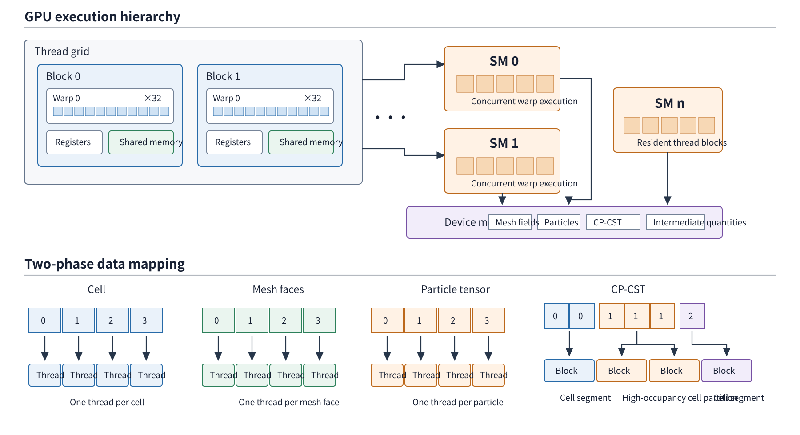

#### Compressed directory and segmented reduction

The structure diagram follows six particles distributed over three cells. The count array defines segment lengths, the exclusive scan creates their boundaries, and $J$ converts scattered ownership into contiguous cell intervals. A block then gathers one interval, evaluates all required physical moments together, performs a warp-tail or block reduction, and writes each cell quantity once. The directory is shared across modules, so collision statistics, particle pressure, macroscopic reconstruction, and compaction reuse the same particle grouping.

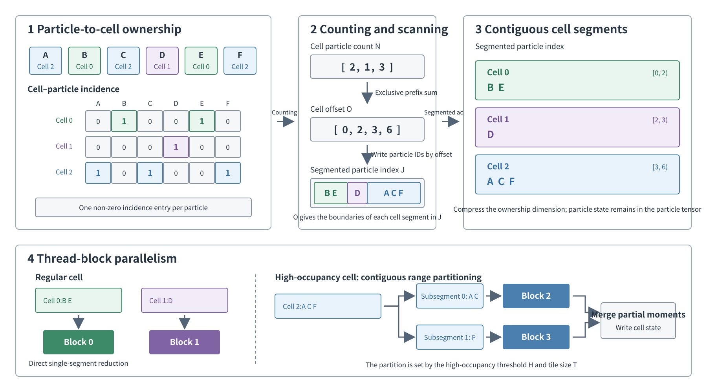

#### Warp-aggregated directory construction

CP-CST construction contains counting, exclusive scan, and segmented-index writing. When several lanes in a warp reference the same cell, E1 groups those lanes before touching global counters. For the example cell-ID sequence $[2,2,2,2,5,5,8,8]$, conventional particle-wise construction performs eight atomic updates. Warp aggregation elects one leader for each distinct cell and reserves groups of four, two, and two slots with three atomic updates. Each remaining lane derives its local rank inside the group and writes directly to its reserved position.

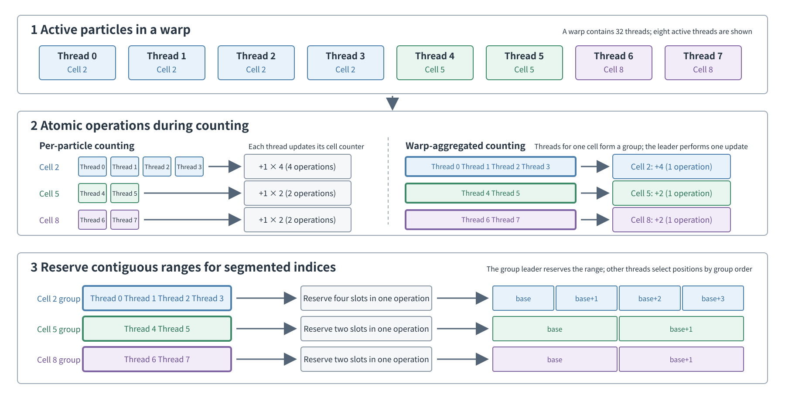

#### High-occupancy-cell scheduling

One block per cell is efficient while segment lengths remain moderate. E2 detects cells above a configurable heavy-cell threshold $H$ and divides their intervals into tiles of at most $T$ particles. With $H=512$ and $T=256$, cells containing 80 and 260 particles retain the regular one-block path, while a 910-particle cell becomes four tasks of $256+256+256+142$ particles. Resident worker blocks claim these tasks dynamically, and a second reduction merges their partial moments. This removes the long tail created by a small number of exceptionally populated cells while preserving one owner thread for every particle state update.

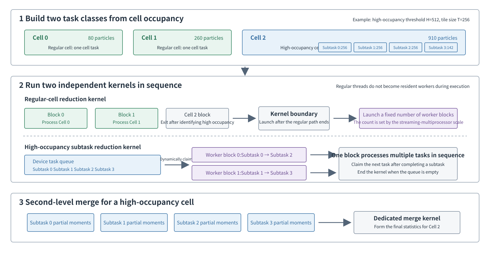

#### Directory reuse through a complete time step

Particle migration changes `cellId`, so the resident algorithm maintains two well-defined directory phases. The pre-migration directory serves the Poisson collision pool and the first particle-pressure half-step. After particle tracking, a rebuilt directory serves final moment recovery, the second pressure half-step, and full-state particle compaction. Compaction writes the complete SoA state into the alternate buffer in cell order and finishes with a pointer swap. This removes inactive holes, places same-cell particles next to one another in memory, and leaves a contiguous region for subsequent injection.

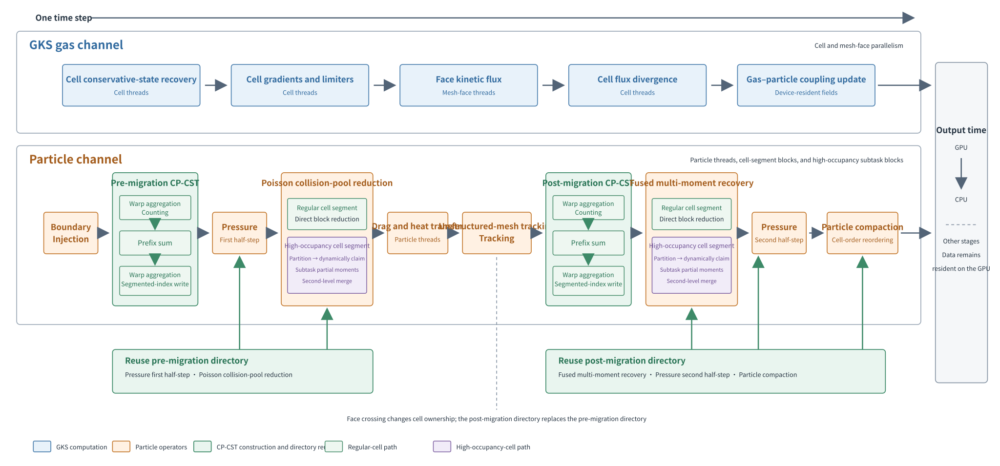

Together, ownership compression reduces repeated searches, warp aggregation reduces conflicting global atomics, fused segmented reduction increases the physical information recovered from each particle read, directory reuse amortizes construction cost across several physics stages, and heavy-cell scheduling limits load imbalance under strongly nonuniform particle distributions.

Three runtime switches expose the execution hierarchy:

| Layer | Switch profile | Main execution path |
|---|---|---|
| **L0 — particle-centered baseline** | `gpuCsrCellLocalPath=false`<br>`gpuCsrWarpAggregatedBinning=false`<br>`gpuCsrHeavyReduction=false` | SoA particle traversal with per-cell atomic accumulation |
| **L1 — CP-CST segmented path** | `gpuCsrCellLocalPath=true`<br>`gpuCsrWarpAggregatedBinning=false`<br>`gpuCsrHeavyReduction=false` | Directory reuse, fused moments, and cell-local compaction |
| **E1 — warp-aggregated CP-CST** | `gpuCsrCellLocalPath=true`<br>`gpuCsrWarpAggregatedBinning=true`<br>`gpuCsrHeavyReduction=false` | L1 with warp-aggregated cell counting and slot reservation |
| **E2 — heavy-cell scheduling** | `gpuCsrCellLocalPath=true`<br>`gpuCsrWarpAggregatedBinning=true`<br>`gpuCsrHeavyReduction=true` | E1 with heavy-cell tiled reduction and resident work scheduling |

L0 suits very sparse occupancy. L1 and E1 target dense cell segments and million-parcel workloads. E2 targets distributions with a small population of exceptionally long cell segments.

## Validation

The validation gallery follows the thesis sequence: gas-phase numerical consistency, two-phase coupling consistency, and nozzle pressure/CP-CST efficiency.

### Gas-phase numerical consistency

The gas validation isolates discontinuity transport, viscous diffusion, Fourier conduction, smooth-wave convergence, and LES eddy viscosity.

| Project | Reference | Reported result |
|---|---|---|
| Sod shock tube | Exact Riemann solution | Relative `L1` errors: density `2.20e-3`, pressure `1.45e-3`, velocity `3.72e-3` |
| Planar Couette flow | Transient Fourier-series solution | Velocity relative `L2` error `3.66e-4` |
| Fourier slab | One-dimensional diffusion solution | Temperature `L2` error `1.88e-2`–`2.57e-2 K` for `Pr=0.4, 0.72, 0.8` |
| Acoustic wave | Linear acoustic mode | Observed orders `2.01`–`2.05` for pressure, density, and velocity |
| Affine LES field | OpenFOAM WALE and Smagorinsky definitions | Relative errors: WALE trace-free `1.32e-11`, WALE compressible `8.83e-11`, Smagorinsky `7.25e-11` |

The WALE matrix includes a trace-free field with `div(U)=0` and a compressible field with `div(U)=6 s^-1`. Together they exercise the deviatoric strain invariant and the full symmetric-gradient invariant used by the OpenFOAM WALE denominator. The updated GPU values match the OpenFOAM analytical expressions within `8.84e-11` relative error.

<details open>
<summary><strong>Sod shock tube</strong></summary>

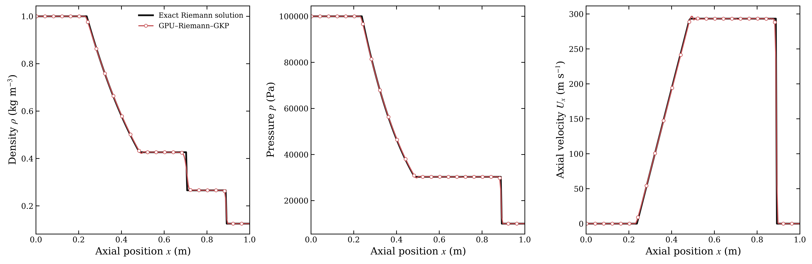
</details>

<details>
<summary><strong>Planar Couette flow</strong></summary>

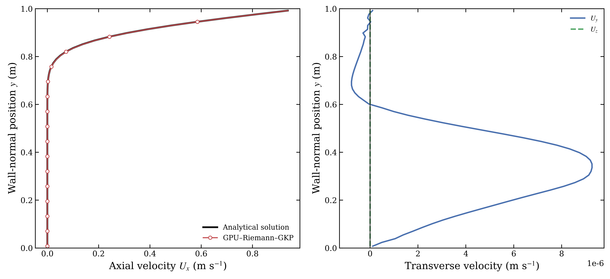
</details>

<details>
<summary><strong>Fourier heat conduction</strong></summary>

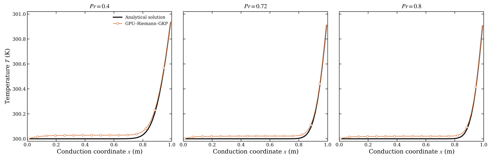
</details>

<details>
<summary><strong>Acoustic convergence</strong></summary>

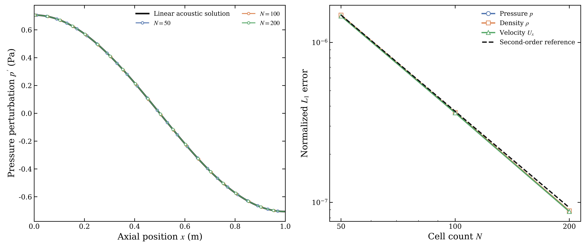
</details>

<details>
<summary><strong>WALE trace-free/compressible and Smagorinsky affine fields</strong></summary>

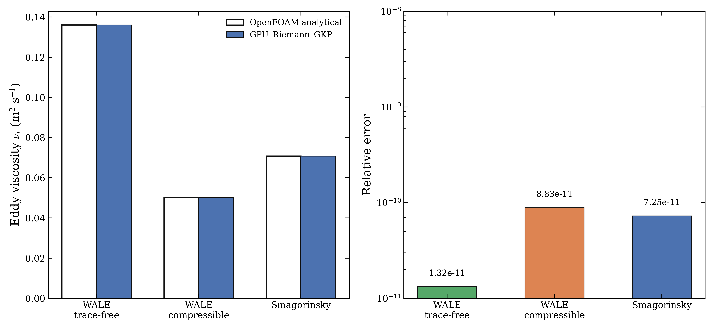
</details>

### Two-phase coupling consistency

DustyBox isolates nonlinear gas–particle drag. DustyWave combines smooth acoustic propagation with two-way drag coupling. The wind–sand shock tube exercises finite-amplitude gas waves, particle transport, drag, and particle material-temperature relaxation.

| Project | Reference | Reported result |
|---|---|---|
| DustyBox | Nonlinear relaxation ODE | Maximum gas and particle velocity errors `7.30e-5` and `3.34e-4` |
| DustyWave | Linearized matrix-exponential solution | Relative amplitude errors `0.0238%`–`0.319%`; phase errors below `5.56e-3 rad` |
| Wind–sand shock tube | Published UGKWP profiles | Field correlations `0.9904`–`0.9997`; gas, density, velocity, and pressure profile errors remain within `3.3%` |
| Particle thermal transport | Published UGKWP profile and cell covariance | The GKP peak reaches `1.27324` at `x=0.695`; the resolved covariance term quantifies the particle-level heat-flux difference |

<details open>
<summary><strong>DustyBox</strong></summary>

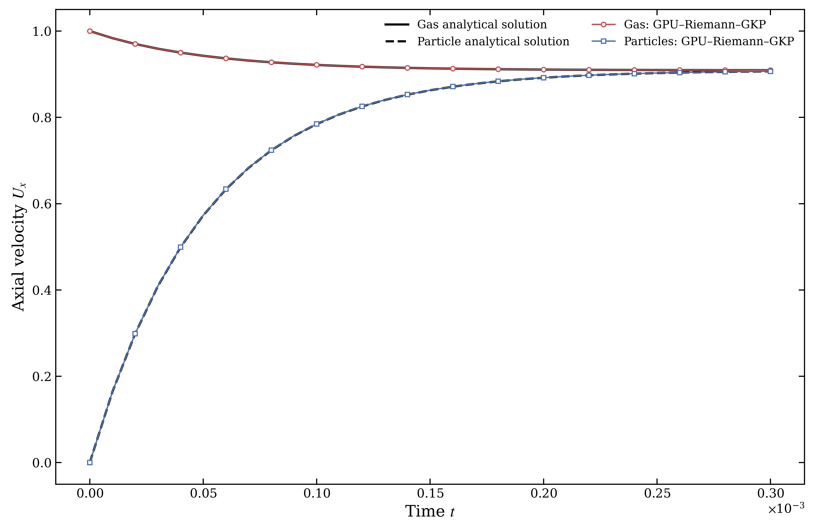
</details>

<details>
<summary><strong>DustyWave</strong></summary>

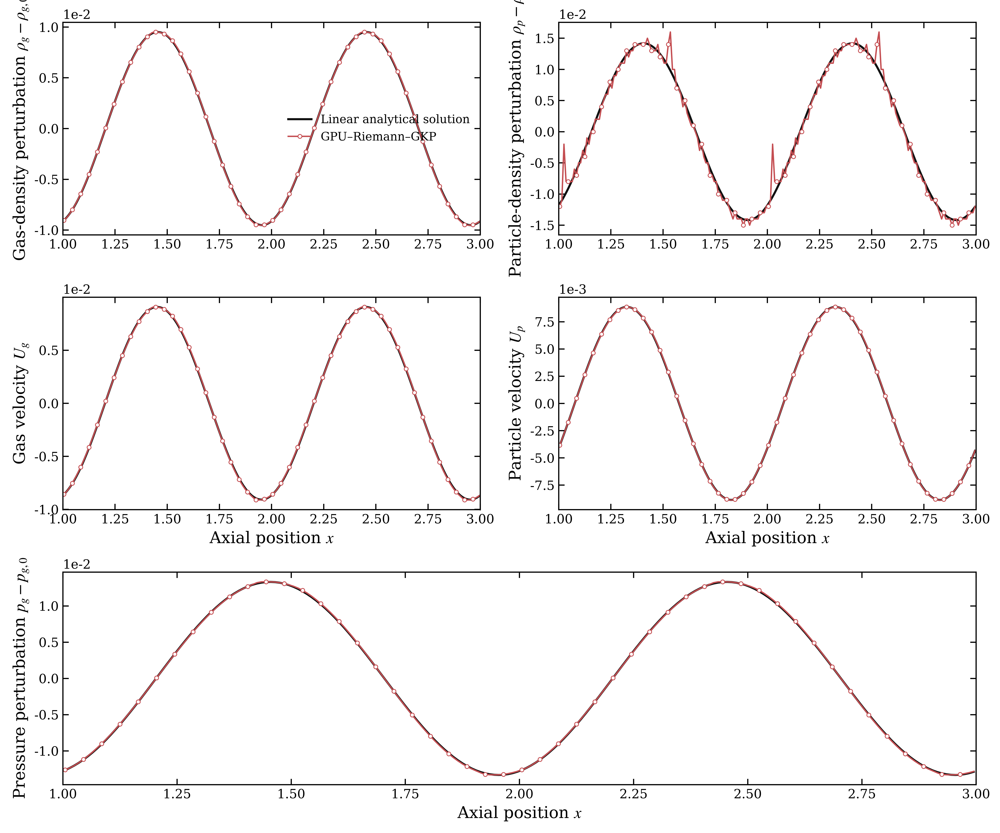
</details>

<details>
<summary><strong>Wind–sand shock tube</strong></summary>

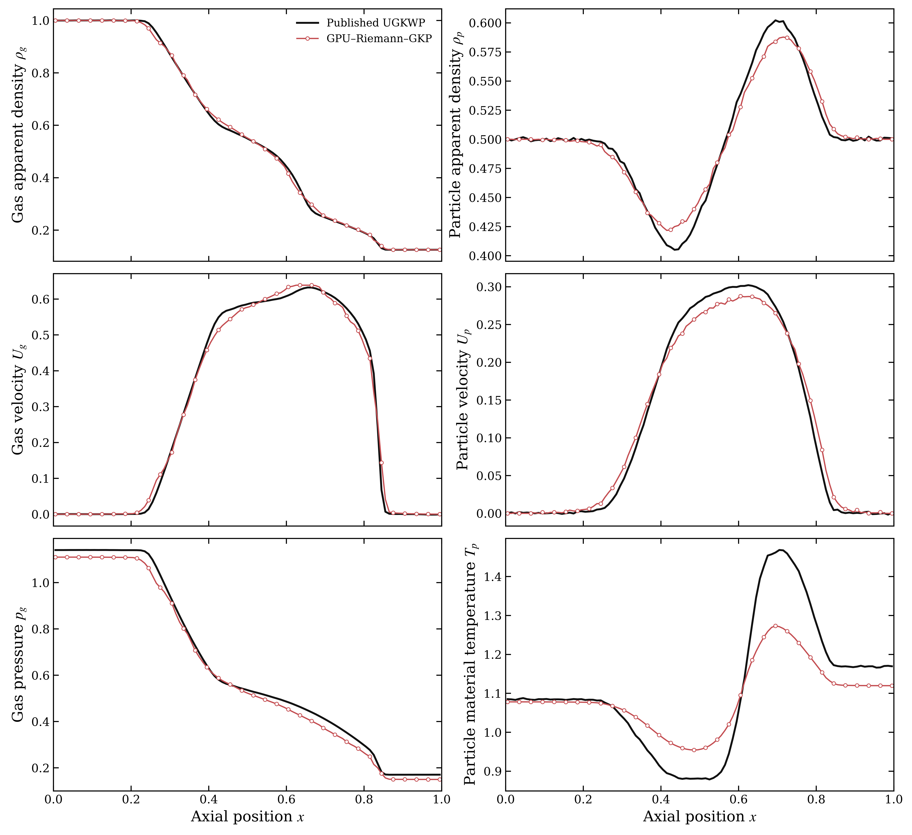
</details>

<details>
<summary><strong>Particle thermal covariance</strong></summary>

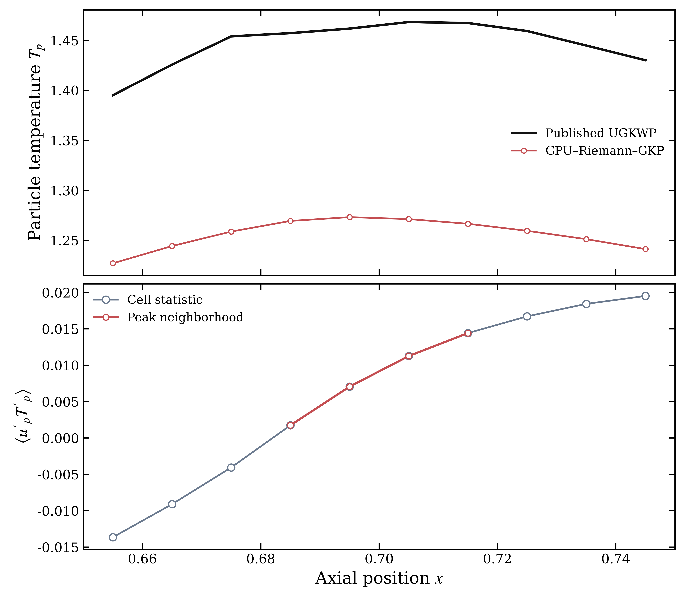
</details>

The particle thermal figure resolves the temperature-carrying particle flux that is absent from a cell-mean-only description. For the GKP representation,

```math
F_{T,\mathrm{GKP}}
=\rho_p C_p\langle u_pT_p\rangle
=\rho_p C_p\left(U_p\overline{T}_p+\langle u'_pT'_p\rangle\right).
```

The covariance contribution increases through the peak region, with representative values `0.00174`, `0.00706`, `0.01127`, and `0.01442` over `x=0.685`–`0.715`. Its positive flux divergence redistributes particle thermal energy and lowers the local temperature peak relative to the published UGKWP profile. At `x=0.705`, the GPU gas state is `(rho_g, p_g) = (0.24862, 0.36248)`, while the reference state is `(0.24553, 0.40488)`; the corresponding gas temperatures are `1.45796` and `1.64904`. The gas temperature is the relaxation target in the particle equation, so this local gas-state difference also contributes to the peak variation. The remaining gas fields stay within `3.3%`, and the field correlations remain above `0.99`.

The GKP result therefore provides higher particle thermal-transport resolution than the published cell-mean UGKWP profile. It resolves the particle velocity–temperature covariance as an explicit transport channel and retains its spatial variation through the peak, while a cell-mean closure absorbs or omits that contribution. The lower, smoother GKP temperature peak is consequently interpreted as a resolved transport correction. The published UGKWP peak may contain a closure error associated with the missing covariance flux and serves as a reference under its original closure rather than an exact particle-temperature solution.

### Nozzle pressure comparison and CP-CST efficiency

The pressure test uses a `0.637 m` axisymmetric converging–diverging nozzle with `7,600` cells. The inlet state is approximately `4.5 MPa` and `3,600 K`; the wall uses a `1,000 K` fixed temperature and a viscous velocity condition. Every gas flux advances the same case to `0.1 s`.

<p align="center">
  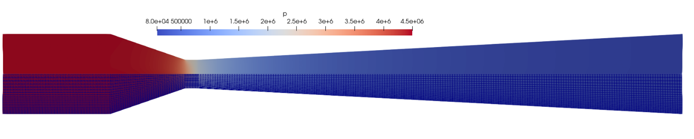
</p>

The axial pressure and Mach-number profiles reproduce the chamber plateau, throat expansion, sonic transition, and supersonic branch. The radial comparison separates core-flow behavior from wall-layer shear resolution.

<p align="center">
  
</p>

<p align="center">
  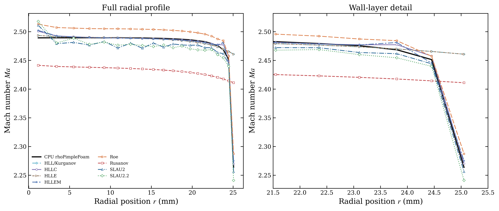
</p>

On an Intel Core i9-14900HK single core, `rhoPimpleFoam` required `7468.44 s`. An RTX 4060 completed the GPU cases in `406.58`–`532.68 s`, corresponding to `14.02x`–`18.37x` end-to-end speedup for this mesh and output schedule.

The CP-CST ablation restarts every case from the shared `0.1 s` gas field and advances particles to `0.11 s`. The sparse group contains about `7.9e3` parcels. The dense group contains about `3.9e6` parcels.

<p align="center">
  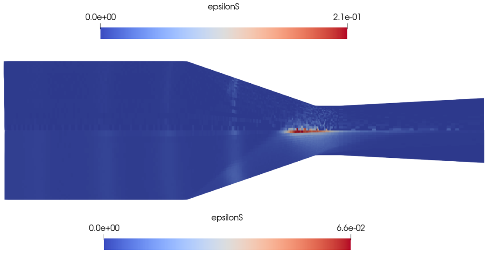
</p>

<p align="center">
  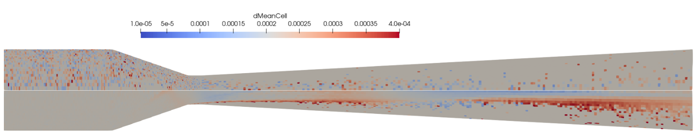
</p>

On an RTX 5090, dense L1 reduced runtime from `1240.68 s` to `685.70 s` and E1 reduced it to `641.89 s`. These values correspond to `1.81x` and `1.93x` speedups over dense L0. Sparse occupancy favored L0 because its particle-centered path carries a smaller fixed setup cost.

<p align="center">
  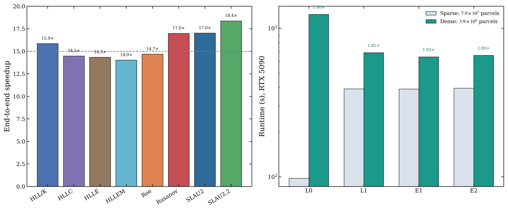
</p>

## Install

### Requirements

- Ubuntu 22.04 x86-64
- OpenFOAM 10 from the OpenFOAM Foundation
- NVIDIA driver with CUDA 13 compatibility
- NVIDIA GPU with compute capability 7.5, 8.0, 8.6, 8.9, or 9.0
- Git, a C++14 compiler, and the OpenFOAM `wmake` tool
- Python 3 for example post-processing

The packaged backend contains native CUDA code for Turing, Ampere, Ada, and Hopper GPUs together with compute 9.0 PTX. Its CUDA runtime is statically linked.

### Clone and install

```bash
mkdir -p "$WM_PROJECT_USER_DIR/applications/solvers"
cd "$WM_PROJECT_USER_DIR/applications/solvers"
git clone https://github.com/zyy212121/gpu-riemann-gkp.git GPU-Riemann-GKP
cd GPU-Riemann-GKP
./install.sh
```

`install.sh` verifies the packaged backend checksum, creates `$FOAM_USER_APPBIN`, installs the backend executable, and compiles the public OpenFOAM frontend. The installed programs are:

```text
$FOAM_USER_APPBIN/GpuGkp
$FOAM_USER_APPBIN/gpu28CudaBackend
```

An OpenFOAM installation at a custom location can be selected with:

```bash
export OPENFOAM_BASHRC=/absolute/path/to/openfoam10/etc/bashrc
./install.sh
```

The `GpuGkp` frontend launches `gpu28CudaBackend` from `$FOAM_USER_APPBIN`. A custom backend location can be selected with:

```bash
export GPU28_CUDA_BACKEND=/absolute/path/to/gpu28CudaBackend
```

## OpenFOAM-style case setup

A GPU–Riemann–GKP case uses the standard OpenFOAM layout:

```text
case/
├── 0/
│   ├── U
│   ├── p
│   ├── T
│   ├── epsilonS
│   ├── Us
│   ├── theta
│   ├── Tp                    # required when particleTemperatureTransport=true
│   ├── k                     # required for kOmegaSST
│   └── omega                 # required for kOmegaSST
├── constant/
│   ├── physicalProperties
│   ├── momentumTransport
│   ├── ugkwpProperties
│   └── polyMesh/             # generated by blockMesh or supplied directly
└── system/
    ├── blockMeshDict
    ├── controlDict
    ├── fvSchemes
    └── fvSolution
```

### Required initial fields

| Field | Meaning | Read behavior |
|---|---|---|
| `U` | Gas velocity | Required |
| `p` | Gas static pressure | Required |
| `T` | Gas temperature | Required |
| `epsilonS` | Solid volume fraction | Required |
| `Us` | Particle mean velocity | Required |
| `theta` | Particle fluctuating energy | Required |
| `Tp` | Particle material temperature | Required when particle temperature transport is active |
| `k` | Turbulent kinetic energy | Required for kOmegaSST |
| `omega` | Specific dissipation rate | Required for kOmegaSST |
| `nut` | Turbulent kinematic viscosity | Generated and written by kOmegaSST |
| `rho`, `rhoU`, `rhoE` | Gas restart state | Read when present and reconstructed from primitive fields for a fresh case |
| `rhoUs`, `rhoEs`, `rhoDs` | Particle-moment restart fields | Read when present and reconstructed for a fresh case |

Pure-gas cases keep the particle fields at zero and set `gpuResidentPureGasOnly true`.

### Gas thermodynamics

`constant/physicalProperties` uses the OpenFOAM `perfectGas + hConst + const` combination:

```foam
thermoType
{
    type            hePsiThermo;
    mixture         pureMixture;
    transport       const;
    thermo          hConst;
    equationOfState perfectGas;
    specie          specie;
    energy          sensibleInternalEnergy;
}

mixture
{
    specie
    {
        molWeight   28.970253;
    }
    thermodynamics
    {
        Cp          1722;
        Hf          0;
    }
    transport
    {
        mu          9.29152148664344e-05;
        Pr          0.4;
    }
}
```

`constant/momentumTransport` selects `laminar`, `WALE`, `Smagorinsky`, or `kOmegaSST`. A minimal SST configuration is:

```foam
simulationType RAS;

RAS
{
    model               kOmegaSST;
    turbulence          on;
    printCoeffs         on;
    turbulentPrandtl    0.9;

    kOmegaSSTCoeffs
    {
        wallTreatment   lowRe;
        kMin            1e-12;
        omegaMin        1e-6;
        maxSourceNumber 0.25;
        F3              false;
    }
}
```

Set `wallTreatment wallFunction` for the wall-function path. Wall-function cases use the standard OpenFOAM `kqRWallFunction` and `omegaWallFunction` patch fields; `nut` is generated by the GPU model.

### Gas numerical schemes

A typical verified first-order momentum and limited-energy setup is:

```foam
fluxScheme      SLAU2.2;

ddtSchemes
{
    default     Euler;
}

gradSchemes
{
    default     Gauss linear;
}

divSchemes
{
    default                             none;
    div(phi,U)                          Gauss upwind;
    div(phi,e)                          Gauss limitedLinear 1;
    div(phi,K)                          Gauss limitedLinear 1;
    div(phi,(p|rho))                    Gauss limitedLinear 1;
    div(((rho*nuEff)*dev2(T(grad(U))))) Gauss linear;
}

laplacianSchemes
{
    default     Gauss linear corrected;
}

interpolationSchemes
{
    default     linear;
}

snGradSchemes
{
    default     corrected;
}
```

The supported explicit time schemes are `Euler`, `SSPRK2`, and `SSPRK3`. A fully upwind set for `div(phi,U)`, `div(phi,e)`, `div(phi,K)`, and `div(phi,(p|rho))` selects first-order reconstruction. The combination shown above selects the verified energy-limited reconstruction.

`system/fvSolution` carries gas safeguards:

```foam
GPU2_8
{
    rhoMin              1e-12;
    TMin                1;
    robustFallback      true;
    maxDiffusionNumber  0.25;
}
```

`system/controlDict` uses the standard OpenFOAM time controls. `adjustTimeStep true`, `maxCo`, `maxDeltaT`, `writeControl`, and `writeInterval` retain their usual meanings.

### Particle and CP-CST controls

`constant/ugkwpProperties` contains the particle model:

```foam
gpuResidentStrict                  true;
gpuResidentPureGasOnly             false;
gpuResidentParticleCapacity        8000000;
gpuResidentRandomSeed              12345;
gpuResidentMaxFaceWalkHops         12;
gpuResidentCourantUpdateInterval   100;
gpuResidentMaxDeltaTGrowth         1.05;

rhoS                               2800;
dS                                 0.000209206;
dMin                               0.00001;
dMax                               0.0004;
dSigma                             0.3;
parcelMass                         1e-11;

particleTemperatureTransport       true;
particleRho                        2800;
particleCp                         1000;
particleTMin                       300;
particleTMax                       5000;

gpuResidentInjectionTheta          1e-12;
gpuResidentInjectionTp             3600;

gpuResidentCollisionalPressure     true;
gpuResidentCollisionalRestitution  0.9;
gpuResidentPressureKickFraction    0.25;

gpuResidentJammingPressure             true;
gpuResidentPackingFraction             0.63;
gpuResidentPackingProjectionIterations 20;

gpuCsrCellLocalPath                true;
gpuCsrWarpAggregatedBinning        true;
gpuCsrHeavyReduction               false;
gpuCsrHeavyCellThreshold           4096;
gpuCsrHeavyTileParticles           4096;
gpuCsrHeavyWorkerBlocksPerSM       4;

particleWallCoeffs
{
    default     1.0;
    outlet      0.0;
}
```

| Entry | Meaning |
|---|---|
| `gpuResidentParticleCapacity` | Maximum resident parcel count allocated on the GPU |
| `gpuResidentRandomSeed` | Reproducible device random-state seed |
| `gpuResidentMaxFaceWalkHops` | Maximum face crossings resolved during one tracking call |
| `gpuResidentCourantUpdateInterval` | GPU steps between full Courant recomputations |
| `gpuResidentMaxDeltaTGrowth` | Upper ratio for successive adaptive time steps |
| `rhoS` | Particle material density |
| `dS` | Representative diameter and fixed diameter when `dSigma=0` |
| `dMin`, `dMax`, `dSigma` | Truncated lognormal diameter limits and logarithmic width |
| `parcelMass` | Physical mass represented by one numerical parcel |
| `particleTemperatureTransport` | Particle material-temperature equation switch |
| `gpuResidentCollisionalPressure` | Granular collisional-pressure switch |
| `gpuResidentPressureKickFraction` | Fractional substep used by the particle-pressure kick |
| `gpuResidentJammingPressure` | Conservative mobile-particle packing-projection switch |
| `gpuResidentPackingFraction` | Maximum mobile-particle packing fraction used by the complementarity projection |
| `gpuResidentPackingProjectionIterations` | Jacobi iteration count and matching fixed active-neighbourhood depth; default 20, minimum 1 |
| `gpuCsrCellLocalPath` | CP-CST L1 path switch |
| `gpuCsrWarpAggregatedBinning` | E1 warp aggregation switch |
| `gpuCsrHeavyReduction` | E2 heavy-cell scheduling switch |
| `particleWallCoeffs` | Patch-specific particle velocity restitution |

Dynamic inlet schedules use `gpuResidentDynamicInlet true` together with `gpuResidentInletPatch`, `gpuResidentPressureTable`, `gpuResidentVolumeFractionTable`, and `gpuResidentInletTemperature`.

## Run an example

```bash
cd "$WM_PROJECT_USER_DIR/applications/solvers/GPU-Riemann-GKP"
cd examples/gks_flux_validation/sodShockTube
./Allrun
```

Each supplied case provides `Allrun` and `Allclean`, or a family-level runner for a flux matrix. The scripts load OpenFOAM 10, construct the mesh, run the solver, and execute the companion post-processing required by that case. Set `OPENFOAM_BASHRC` before `Allrun` when OpenFOAM is installed at a custom location.

| Example family | Coverage |
|---|---|
| `examples/gks_flux_validation` | Sod, Couette, Fourier, and acoustic-wave gas validation |
| `examples/les_validation` | WALE and Smagorinsky affine-field checks plus low-Re and wall-function SST smoke cases |
| `examples/twophaseflux` | DustyBox, DustyWave, and wind–sand shock tube |
| `examples/pressuretest/GPU_gas` | Eight Riemann fluxes on the nozzle pressure test |
| `examples/pressuretest/GPU_twophase/cp_cst_test` | L0, L1, E1, and E2 sparse/dense CP-CST runs |
| `examples/pressuretest/cpu_rhoPimpleFoam` | OpenFOAM pressure-based reference case |

## Release layout

```text
GPU-Riemann-GKP/
├── diluteUgkwpFoam.C              # OpenFOAM frontend source for the GpuGkp executable
├── createFields.H                 # field and material-property setup
├── readGpuGasConfiguration.H      # OpenFOAM numerical configuration
├── gpu/                           # frontend API, protocol, boundary schedule, client
├── backend/                       # executable-only CUDA backend, manifest, checksum, licence
├── install.sh                     # backend installation and frontend compilation
├── CHANGELOG.md                   # public version history and migration notes
├── scripts/                       # shared OpenFOAM environment discovery
├── Make/                          # OpenFOAM build metadata
├── examples/                      # minimal runnable cases
└── assets/                        # README visuals and validation figures
```

The repository publishes the GPL-3.0-or-later OpenFOAM frontend source, public process protocol, runnable cases, and a precompiled CUDA backend. CUDA backend implementation source remains in the private development repository. The separate executable boundary keeps OpenFOAM libraries in `GpuGkp` and CUDA runtime code in `gpu28CudaBackend`; the backend binary is governed by [`backend/BINARY-LICENSE.txt`](backend/BINARY-LICENSE.txt).

The backend manifest is available in [`backend/manifest.txt`](backend/manifest.txt), and [`backend/SHA256SUMS`](backend/SHA256SUMS) provides the release checksum.

## Citation and license

Citation metadata is available in [CITATION.cff](CITATION.cff). The public OpenFOAM frontend source uses GPL-3.0-or-later terms. The executable-only CUDA backend uses the terms in [`backend/BINARY-LICENSE.txt`](backend/BINARY-LICENSE.txt). [NOTICE](NOTICE) records the distribution boundary and third-party attribution.
